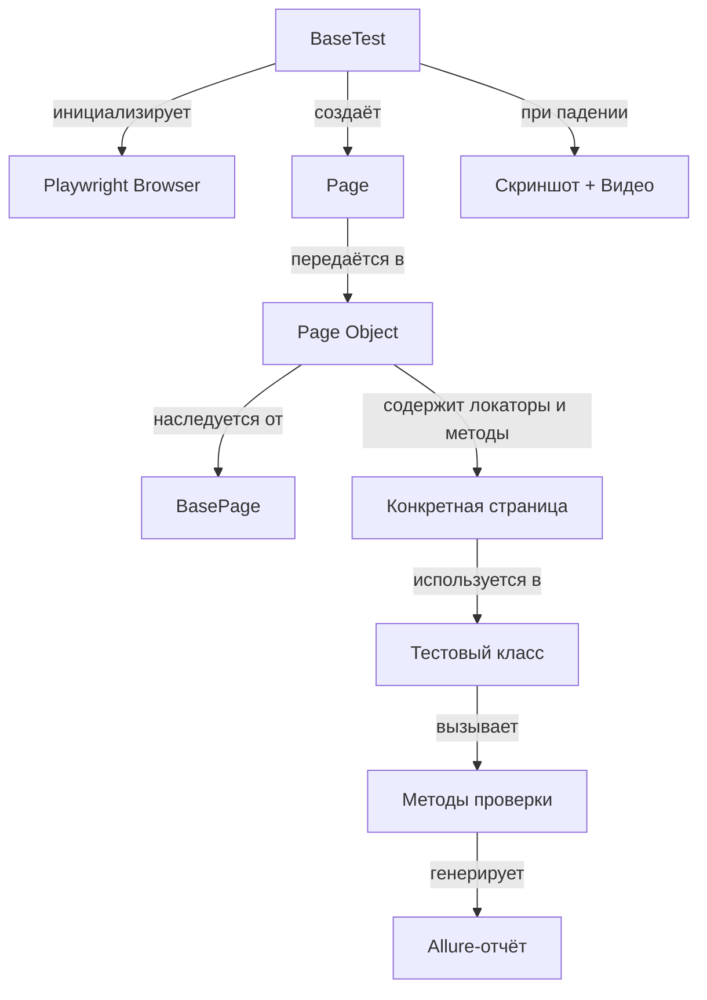

# 🚀 Автотесты для сайта DEMOQA


> **Самостоятельная работа над проектом по автоматизированному тестированию веб-интерфейса сайта [demoqa.com](https://demoqa.com).**

## 📖 Описание

Проект представляет собой набор автотестов, написанных на Java с использованием фреймворка **Playwright** для Microsoft.
Тесты проверяют корректность работы стандартных элементов пользовательского интерфейса (Elements), а также функциональность авторизации, загрузки/скачивания файлов и проверки ссылок:

- Текстовые поля (`Text Box`)
- Чек-боксы (`Check Box`)
- Радио-кнопки (`Radio Button`)
- Кнопки с разными типами кликов (`Buttons`)
- Веб-таблицы (`Web Tables`)
- Загрузка и скачивание файлов (`Upload & Download`)
- Страница авторизации (`Login`)
- Проверка ссылок и HTTP-статусов (`Links`)

Для структурирования кода используется паттерн **Page Object Model (POM)**, что делает тесты легко читаемыми, поддерживаемыми и расширяемыми.

## 🛠️ Технологический стек

| Категория | Инструмент |
|---|---|
| **Язык** | Java 17+ |
| **Сборка** | Gradle (Wrapper) |
| **Тестовый фреймворк** | JUnit 5 (`@Test`, `@BeforeAll`, ...) |
| **Драйвер браузера** | Playwright (`com.microsoft.playwright`) |
| **Паттерн** | Page Object Model (POM) |
| **Отчёты** | Allure Framework (`@Step`, `@Epic`, `@Story`) |
| **API-тестирование** | REST Assured (для проверки статусов ссылок) |

## 📌 Требования к окружению

Перед запуском убедитесь, что у вас установлено:

- **Java 17** или новее (проверьте `java -version`)
- **Git** (для клонирования репозитория)
- **Браузеры**: Playwright автоматически скачает Chromium, Firefox и WebKit при первом запуске (достаточно интернета)
- **Allure CLI** (опционально, для просмотра отчётов) – можно установить через [Homebrew](https://brew.sh/), [Scoop](https://scoop.sh/) или скачать с [официального сайта](https://allurereport.org/docs/gettingstarted-installation/).

## 🗂️ Структура проекта

```
United2/
├── build.gradle                        # Конфигурация сборки и зависимостей
├── gradlew / gradlew.bat               # Gradle Wrapper (Linux / Windows)
├── src/
│   ├── main/java/
│   │   └── Halpers.java               # Вспомогательные утилиты (генерация случайных строк и чисел)
│   └── test/java/
│       ├── Pages/
│       │   ├── BasePage.java          # Базовый класс страницы (URL, инициализация Playwright)
│       │   ├── BookStoreApplication/
│       │   │   └── LoginPage.java     # Страница авторизации
│       │   └── Elements/              # Пейдж-обджекты элементов
│       │       ├── TextBoxPage.java   #   - Текстовые поля
│       │       ├── CheckboxPage.java  #   - Чек-боксы (дерево)
│       │       ├── RadioButtonPage.java #   - Радио-кнопки
│       │       ├── ButtonsPage.java   #   - Кнопки
│       │       ├── Webtables.java     #   - Веб-таблицы
│       │       ├── Up_Down_Load.java  #   - Загрузка и скачивание файлов
│       │       └── LinksPage.java     #   - Проверка ссылок и HTTP-статусов
│       └── tests/
│           ├── BaseTest.java          # Базовый тестовый класс (setup/teardown, скриншоты, видео)
│           ├── SetValueInInput.java   # Тесты текстовых полей
│           ├── CheckboxesClick.java   # Тесты чек-боксов
│           ├── TryRadioButton.java    # Тесты радио-кнопок
│           ├── ClickButtonsTest.java  # Тесты кликов по кнопкам
│           ├── TryWebtables.java      # Тесты работы с таблицами
│           ├── Login.java             # Тесты авторизации
│           └── Up_Down_Load_Tests.java # Тесты загрузки/скачивания файлов
├── allure-report/                     # Сгенерированные Allure-отчёты
│   ├── data/                          # JSON-данные для отчётов (behaviors, categories, packages, etc.)
│   ├── export/                        # Экспорт в форматы InfluxDB, Prometheus, mail.html
│   ├── history/                       # История запусков (тренды)
│   ├── widgets/                       # Виджеты для dashboard (статусы, длительность, тренды)
│   └── index.html                     # Главная страница отчёта
├── screenshots/                       # Скриншоты при падении тестов
├── videos/                            # Видеозаписи выполнения тестов
└── README.md                          # Ты сейчас здесь :)
```

## ✅ Тестовое покрытие

Ниже описано, что именно и как проверяется в каждом тестовом классе:

| Тест-класс | Сценарии проверки |
|---|---|
| **SetValueInInput** | Заполнение текстовых полей (комбинации: только имя, имя+почта, полный адрес). Проверка появления корректных данных в блоке вывода после сабмита. |
| **CheckboxesClick** | Разворачивание всего дерева элементов (Desktop → Downloads). Выбор отдельных узлов. Проверка текста результата для разных комбинаций чек-боксов. |
| **TryRadioButton** | Клик по тексту радио-кнопки и по самому кружку. Проверка переключения между `Yes` и `Impressive` и невозможность выбора `No`. |
| **ClickButtonsTest** | **Double Click:** двойной клик и проверка сообщения. **Right Click:** клик правой кнопкой и проверка сообщения. **Dynamic Click:** обычный клик. Проверка одновременного появления трёх сообщений после трёх кликов. |
| **TryWebtables** | **CRUD:** Создание новых строк со случайными данными, редактирование, удаление. **Пагинация:** навигация `Next/Previous/First/Last`, изменение количества строк на странице (10/20/30). |
| **Login** | Проверка авторизации с корректными и некорректными данными. |
| **Up_Down_Load_Tests** | Скачивание файла (проверка имени и содержимого). Загрузка файлов разных форматов (.jpeg, .exe, .pdf) с проверкой отображения пути. |

## 🚀 Запуск тестов

Для запуска тестов используется Gradle Wrapper (установка Java и Gradle не требуется локально, JDK должен быть в `PATH`).

```
# Клонирование репозитория
git clone https://github.com/Vanya2894/United2.git
cd United2

# Запуск всех тестов (Linux/Mac)
./gradlew clean test

# Запуск всех тестов (Windows)
gradlew.bat clean test

# Запуск конкретного тестового класса
./gradlew test --tests "tests.ClickButtonsTest"
```

> **Примечание:** По умолчанию браузер запускается в оконном режиме (`setHeadless(false)`). Если хочешь запустить тесты в фоновом режиме, измени настройки в `src/test/java/tests/BaseTest.java`.

## 🏗️ Архитектура проекта

Проект построен на паттерне **Page Object Model**:

- **`BasePage`** – содержит общие методы для работы со страницами (открытие URL, инициализация Playwright-элементов). Все страницы-наследники используют его.
- **`BaseTest`** – отвечает за настройку и завершение работы браузера (`@BeforeAll` / `@AfterAll`), а также предоставляет экземпляр `Page` для всех тестов. Включает автоматическое создание скриншотов и видео при падении тестов.
- **Страницы (Pages)** – инкапсулируют логику взаимодействия с конкретными элементами. Каждый класс страницы содержит локаторы и методы для действий (клик, ввод, проверка).
- **Тесты (Tests)** – используют страницы, чтобы выполнять проверки. Тесты не содержат локаторов или прямых вызовов Playwright – только вызовы методов страниц.

Такая архитектура позволяет легко поддерживать код: при изменении интерфейса сайта достаточно обновить только соответствующий Page-класс, не трогая тесты.

### Схема взаимодействия компонентов


## 📊 Отчёты Allure

Проект настроен на генерацию наглядных отчётов с помощью **Allure Framework**. После каждого запуска тестов в директории `build/allure-results` сохраняются результаты, которые затем можно визуализировать.

### Структура Allure-отчёта

Allure-отчёт состоит из следующих компонентов:

| Компонент | Описание |
|---|---|
| **`data/`** | JSON-файлы с данными для построения отчёта: `behaviors.json` (группировка по поведению), `categories.json` (категории ошибок), `packages.json` (по пакетам), `suites.json` (по наборам тестов), `timeline.json` (временная шкала). |
| **`export/`** | Экспорт данных в форматы для мониторинга: `influxDbData.txt` (для InfluxDB), `prometheusData.txt` (для Prometheus), `mail.html` (email-уведомление). |
| **`history/`** | История запусков для построения трендов: `duration-trend.json` (тренд длительности), `history-trend.json` (тренд статусов), `categories-trend.json` (тренд категорий), `retry-trend.json` (тренд перезапусков). |
| **`widgets/`** | Виджеты для главной страницы отчёта: статус-чарт, длительность, окружение, исполнители, severity и т.д. |
| **`index.html`** | Основная страница отчёта. |

### Генерация и открытие отчёта

1. Выполни тесты:

```
./gradlew clean test
```
1. Сгенерируй и открой отчёт:

```
allure serve build/allure-results
```

Ты увидишь детальные шаги, скриншоты (при наличии) и статус каждого теста.

> Если Allure CLI не установлен, можно использовать плагин для Gradle:

```
./gradlew allureReport
```

Отчёт будет собран в `build/reports/allure-report/`, но его удобнее открывать через `allure serve`.

## ⚙️ Настройка проекта

Если зависимости не подтягиваются автоматически, выполните:

```
./gradlew build
```

Это загрузит все необходимые библиотеки (Playwright, JUnit, Allure и т.д.).
Для ручной синхронизации в IntelliJ IDEA используйте **Refresh Gradle Project**.

### Конфигурация Playwright

Playwright настраивается в `BaseTest.java`:

- **`setHeadless(false)`** – запуск с открытым браузером (для отладки).
- **`setHeadless(true)`** – запуск в фоновом режиме (для CI).
- **`setScreenshot(ScreenshotPolicy.ON_FAILURE)`** – делать скриншот при падении теста.
- **`setVideo(VideoPolicy.ON)`** – записывать видео выполнения теста (полезно для анализа).
- **`setTrace(TracePolicy.ON)`** – записывать трассировку действий (можно открыть в Playwright Inspector).

Эти параметры можно вынести в `gradle.properties` или в системные свойства (`-Dheadless=true`).

## 🧩 Добавление новых тестов

Чтобы добавить новый тест:

1. **Создай новый Page-класс** в `src/test/java/Pages/`, если тестируешь новый элемент. Унаследуй его от `BasePage`.
1. **Опиши локаторы и методы** взаимодействия с элементом (клик, ввод, получение текста).
1. **Создай новый тестовый класс** в `src/test/java/tests/`. Унаследуй его от `BaseTest`.
1. **Используй Page-класс** внутри тестовых методов.
1. **Запусти тест** локально для проверки.

**Пример** (гипотетический тест для кнопок):

```
@Test
void testClickMeButton() {
    ButtonsPage buttonsPage = new ButtonsPage(page);
    navigateTo(buttonsPage);
    buttonsPage.clickDynamicButton();
    assertTrue(buttonsPage.getClickMessage().contains("You have done a dynamic click"));
}
```

## ⚠️ Известные проблемы (Bugs)

В процессе тестирования были выявлены некоторые особенности или баги на стороне тестируемого сайта, которые отражены в коде:

1. **Webtables — Удаление строки:**
   После удаления строки `delete-record-2`, метод `getByRole` показывает, что строк осталось 2 вместо ожидаемых 3. *(В коде оставлен комментарий «Баг системы»)*.
1. **Webtables — Поиск:**
   При поиске по существующему значению поисковая строка не возвращает ожидаемое количество результатов (0 вместо 1).
1. **Загрузка файлов:** Некоторые форматы (например, `.exe`) могут не отображаться в поле результата, хотя файл физически загружается.

## ❓ Устранение неполадок

- **Ошибка `java.lang.UnsupportedClassVersionError`** – убедитесь, что используется Java 17+.
- **Playwright не скачивает браузеры** – проверьте интернет-соединение и выполните `./gradlew test` – при первом запуске Playwright автоматически загрузит их.
- **Allure не найден** – установите Allure CLI или используйте `./gradlew allureReport`, а затем откройте `build/reports/allure-report/index.html` в браузере.
- **Тесты падают с `TimeoutError`** – возможно, страница загружается дольше. Увеличьте таймаут в `BasePage` (метод `setDefaultTimeout`).

## 📝 TODO / Планы по развитию

- Реализовать класс `Halpers.java` (генерация случайных строк и чисел).
- Добавить тесты для загрузки/скачивания файлов.
- Добавить тесты для авторизации.
- Добавить чтение тестовых данных из файлов (JSON/YAML) или `DataProvider`.
- Настроить CI/CD (например, GitHub Actions) для автоматического запуска при пуше.
- Добавить конфигурацию для параллельного запуска тестов.
- Реализовать больше сценариев для чек-боксов, таблиц и остальных разделов сайта.
- Внедрить логирование для каждого шага теста (например, через `@Step` Allure).
- Добавить тесты для раздела **Alerts, Frame & Windows**.

## 🔗 Полезные ссылки

- [Playwright для Java](https://playwright.dev/java/)
- [JUnit 5](https://junit.org/junit5/)
- [Allure Framework](https://allurereport.org/)
- [Gradle User Guide](https://docs.gradle.org/)
- [DEMOQA](https://demoqa.com/)

## 📄 Лицензия

Этот проект распространяется под лицензией **MIT**. Вы можете свободно использовать, изменять и распространять его с указанием авторства.

## 🤖 Использование ИИ

При разработке данного проекта **примерно 10%** кода было создано с использованием инструментов искусственного интеллекта (генерация шаблонов, рефакторинг, помощь в написании тестов). В том числе оформление README.md.

## 👨‍💻 Автор

**Иван Хлыпало (Ivan Khlypalo)**

- **GitHub:** [Vanya2894](https://github.com/Vanya2894)

*Проект создан в учебных целях для практики написания UI-автотестов.*

## 📋 Список изменений

| Дата | Версия | Изменения |
|---|---|---|
| 29.06.2026 | 1.1.0 | Добавлены разделы: Allure-отчёты, новые Page Object (`LoginPage`, `Up_Down_Load`, `LinksPage`), тесты для авторизации и загрузки/скачивания файлов. Обновлена структура проекта. Добавлена Mermaid-схема архитектуры. |
| 01.06.2026 | 1.0.0 | Первоначальная версия: тесты для Text Box, Check Box, Radio Button, Buttons, Web Tables. |